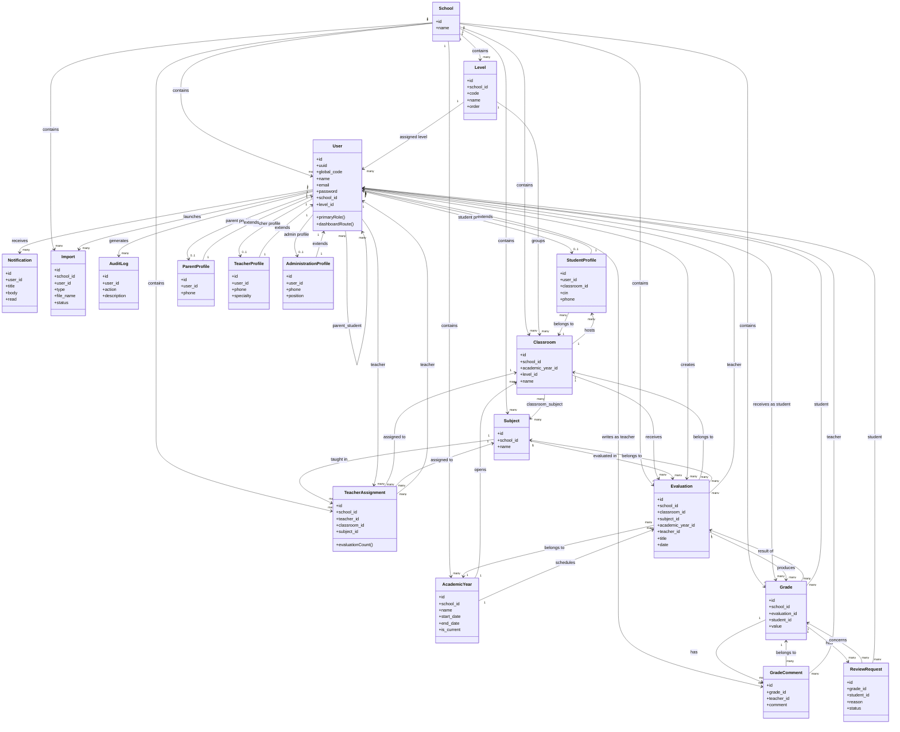

# Diagramme de Classes

Ce diagramme représente les classes métier principales du projet et leurs relations.

## Relations importantes à comprendre

### 1. `User` est l'entité centrale

Un utilisateur peut être :

- `student`
- `parent`
- `teacher`
- `school_admin`
- `super_admin`

Le rôle est géré par le système de permissions, tandis que les données complémentaires sont stockées dans :

- `StudentProfile`
- `ParentProfile`
- `TeacherProfile`
- `AdministrationProfile`

### 2. Relation parent - enfant

La relation parent/enfant est une relation `many-to-many` entre `User` et `User` via la table pivot `parent_student`.

Cela permet :

- à un parent de suivre plusieurs enfants
- à un enfant d'être lié à un ou plusieurs parents

### 3. Chaîne pédagogique principale

Le flux métier principal est :

`School` → `Level` → `Classroom` → `Subject` → `Evaluation` → `Grade`

Puis :

- `Grade` peut recevoir des `GradeComment`
- `Grade` peut recevoir des `ReviewRequest`

### 4. Affectation des enseignants

`TeacherAssignment` relie :

- un enseignant
- une classe
- une matière

Cette table explique qui enseigne quoi, et dans quelle classe.

### 5. Administration et suivi

Les entités suivantes servent au pilotage :

- `Notification`
- `Import`
- `AuditLog`

Elles permettent respectivement :

- d'informer les utilisateurs
- d'importer des données
- de tracer les actions importantes
