# Diagramme de Cas d'Usage

Ce diagramme montre qui utilise la plateforme et quelles sont les actions principales disponibles.

```mermaid
flowchart TD
    SA[Super Admin]
    SCA[School Admin]
    T[Teacher]
    P[Parent]
    ST[Student]

    UC1([Se connecter])
    UC2([Gérer profil])
    UC3([Consulter notifications])
    UC4([Consulter notes])
    UC5([Consulter demandes de revision])
    UC6([Consulter opportunites])
    UC7([Consulter portfolio])
    UC8([Consulter aide])

    UC9([Consulter dashboard etudiant])
    UC10([Consulter dashboard parent])
    UC11([Consulter dashboard enseignant])
    UC12([Consulter dashboard administration])

    UC13([Creer evaluation])
    UC14([Saisir notes])
    UC15([Ajouter commentaire de note])
    UC16([Consulter evaluations de classe])

    UC17([Suivre enfants])
    UC18([Demander revision de note])

    UC19([Gerer utilisateurs])
    UC20([Gerer ecoles])
    UC21([Gerer annees academiques])
    UC22([Gerer niveaux])
    UC23([Gerer classes])
    UC24([Gerer matieres])
    UC25([Gerer affectations enseignants])
    UC26([Lancer import])
    UC27([Consulter rapports])

    SA --> UC1
    SA --> UC2
    SA --> UC3
    SA --> UC4
    SA --> UC5
    SA --> UC6
    SA --> UC8
    SA --> UC12
    SA --> UC19
    SA --> UC20
    SA --> UC21
    SA --> UC22
    SA --> UC23
    SA --> UC24
    SA --> UC25
    SA --> UC26
    SA --> UC27

    SCA --> UC1
    SCA --> UC2
    SCA --> UC3
    SCA --> UC4
    SCA --> UC5
    SCA --> UC6
    SCA --> UC8
    SCA --> UC12
    SCA --> UC19
    SCA --> UC21
    SCA --> UC22
    SCA --> UC23
    SCA --> UC24
    SCA --> UC25
    SCA --> UC26
    SCA --> UC27

    T --> UC1
    T --> UC2
    T --> UC3
    T --> UC4
    T --> UC5
    T --> UC6
    T --> UC7
    T --> UC8
    T --> UC11
    T --> UC13
    T --> UC14
    T --> UC15
    T --> UC16

    P --> UC1
    P --> UC2
    P --> UC3
    P --> UC4
    P --> UC5
    P --> UC6
    P --> UC8
    P --> UC10
    P --> UC17
    P --> UC18

    ST --> UC1
    ST --> UC2
    ST --> UC3
    ST --> UC4
    ST --> UC5
    ST --> UC6
    ST --> UC7
    ST --> UC8
    ST --> UC9
```

## Résumé

- Tous les rôles peuvent se connecter, gérer leur profil et consulter leurs informations personnelles.
- `teacher` travaille surtout sur les évaluations, les notes et les commentaires.
- `parent` travaille surtout sur le suivi des enfants et les demandes de révision.
- `student` consulte principalement sa progression.
- `school_admin` et `super_admin` pilotent la gestion de la plateforme.
- `super_admin` a en plus la gestion globale des écoles.
